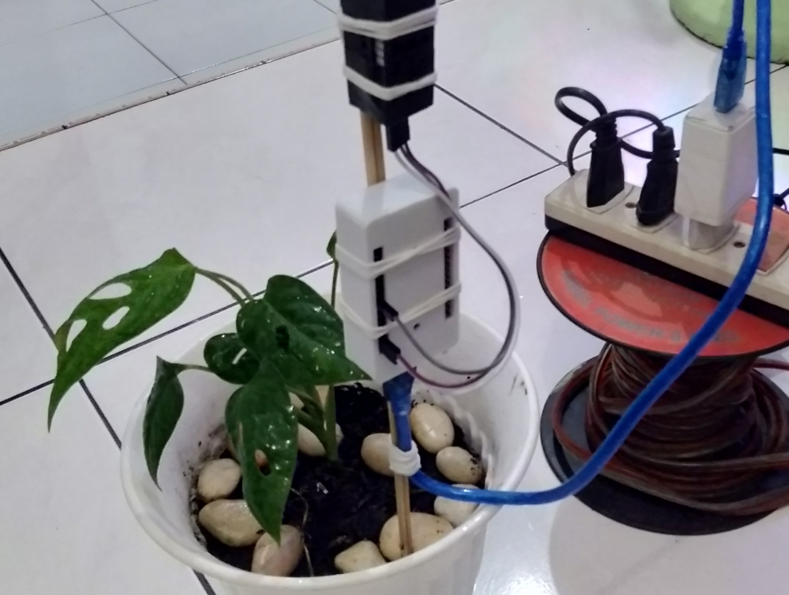

[](https://github.com/ellerbrock/open-source-badges/)
[](https://opensource.org/licenses/MIT)


# Monitoring-Suhu-Kelembaban-Udara-Tanaman-Hias-Janda-Bolong
<strong>Proyek Tim - Informatika UPN Veteran Jatim</strong><br><br>
Janda bolong adalah tanaman dari spesies Araceae atau talas-talasan yang dapat bertahan hidup secara optimum di suhu 23-30°C, dengan kelembapan udara kurang dari 40%. Suhu dan kelembapan udara harus diperhatikan setiap saat, sebab perubahan yang ekstrim bisa memicu tanaman ini menjadi layu. Proyek ini dibuat untuk mempermudah pengguna dalam mengawasi perubahan suhu dan kelembapan udara yang ada di area tanam janda bolong secara realtime, sehingga pengguna akan lebih diuntungkan dari segi waktu dan tenaga. Proyek ini telah dilaksanakan dan memakan waktu kurang lebih 1 bulan. Manfaat dari pembuatan proyek ini tidak lain adalah untuk menjaga tumbuh kembang tanaman janda bolong. Hasil penelitian menunjukkan bahwa sistem yang dibuat dapat berfungsi dengan baik. Antarmuka sistem menggunakan Bot Telegram dan Website.

<br><br>

## Kebutuhan Proyek
| Bagian | Deskripsi |
| --- | --- |
| Papan Pengembangan | NodeMCU V3 ESP8266 Lolin |
| Editor Kode | • Arduino IDE<br>• Visual Studio Code |
| Dukungan Aplikasi | Bot Telegram |
| Driver | CH340 USB Driver |
| Platform IoT | ThingSpeak |
| Protokol Komunikasi | • Hypertext Transfer Protocol (HTTP)<br>• MTProto |
| Arsitektur IoT | 4 Lapisan |
| Kerangka Kerja | Bootstrap |
| Bahasa Pemrograman | • C/C++<br>• JavaScript<br>• PHP |
| Pustaka Arduino | • ESP8266WiFi (bawaan)<br>• ThingSpeak<br>• DHT_sensor_library<br>• CTBot<br>• ArduinoJson |
| Sensor | DHT22: Air Temperature & Humidity (x1) |
| Komponen Lainnya | • Kabel USB Mikro - USB tipe A (x1)<br>• Kabel jumper (1 set)<br>• Kotak casing (x1)<br>• Adaptor DC 5V (x1) |

<br><br>

## Unduh & Instal
1. Arduino IDE

   <table><tr><td width="810">

   ```
   https://bit.ly/ArduinoIDE_Installer
   ```

   </td></tr></table><br>

2. CH340 USB Driver

   <table><tr><td width="810">

   ```
   https://bit.ly/CH340_USB_Driver
   ```

   </td></tr></table>
   
<br><br>

## Rancangan Proyek


<br><br>

## Pengaturan Arduino IDE
1. Buka ``` Arduino IDE ``` terlebih dahulu, kemudian buka proyek dengan cara klik ``` File ``` -> ``` Open ``` :  

   <table><tr><td width="810">
      
      ``` monitoring_suhu.ino ```

   </td></tr></table><br>
   
2. Isi ``` Url Pengelola Papan Tambahan ``` di Arduino IDE 

   <table><tr><td width="810">
   
      Klik ``` File ``` -> ``` Preferences ``` -> masukkan ``` Boards Manager Url ``` dengan menyalin tautan berikut :
      
      ```
      http://arduino.esp8266.com/stable/package_esp8266com_index.json
      ```

   </td></tr></table><br>
   
3. ``` Pengaturan Board ``` di Arduino IDE

   <table>
      <tr><th width="810">

      Cara mengatur board ``` NodeMCU V3 ESP8266 Lolin ```
            
      </th></tr>
      <tr><td>
         
      • Klik ``` Tools ``` -> ``` Board ``` -> ``` Boards Manager ``` -> Instal ``` esp8266 ```. 
      
      • Kemudian klik ``` Tools ``` -> ``` Board ``` -> ``` ESP8266 Boards ``` -> ``` NodeMCU 1.0 (ESP-12E Module) ```.

      </td></tr>
   </table><br>
   
4. ``` Ubah Kecepatan Papan ``` di Arduino IDE 

   <table><tr><td width="810">
   
      Klik ``` Tools ``` -> ``` Upload Speed ``` -> ``` 9600 ```

   </td></tr></table><br>
   
5. ``` Instal Pustaka ``` di Arduino IDE 

   <table><tr><td width="810">
   
      Unduh semua file zip pustaka. Kemudian tempelkan di: ``` C:\Users\Computer_Username\Documents\Arduino\libraries ```

   </td></tr></table><br>

6. ``` Pengaturan Port ``` di Arduino IDE 

   <table><tr><td width="810">
   
      Klik ``` Port ``` -> Pilih sesuai dengan port perangkat anda ``` (anda dapat melihatnya di Device Manager) ```

   </td></tr></table><br>

7. Ubah ``` Nama WiFi ```, ``` Kata Sandi WiFi ```, dan sebagainya sesuai dengan apa yang anda gunakan saat ini.<br><br>

8. Sebelum mengunggah program, silakan klik: ``` Verify ```.<br><br>

9. Jika tidak ada kesalahan dalam kode program, silakan klik: ``` Upload ```.<br><br>

10. Jika masih ada masalah saat unggah program, maka coba periksa pada bagian ``` driver ``` / ``` port ``` / ``` yang lainnya ```.

<br><br>

## Pengaturan ThingSpeak
1. Memulai ThingSpeak : 

   <table><tr><td width="810">
   
      • Silakan <a href="https://thingspeak.com/login">Masuk</a> agar dapat mengakses layanan ThingSpeak.
      
      • Jika anda belum memiliki akun ThingSpeak silakan buat dulu.

   </td></tr></table><br>

2. Membuat channel : 

   <table><tr><td width="810">
   
      • Setelah masuk ke dalam akun -> klik ``` New Channel ```.
   
      • Isi form sesuai dengan kebutuhan anda.
   
      • Klik ``` Save Channel ```.
   
      • Klik ``` Sharing ``` -> pada bagian ``` Channel Sharing Settings ``` silakan pilih -> ``` Share channel view with everyone ```.

   </td></tr></table><br>

3. Membuat visualization : 

   <table><tr><td width="810">
   
      • Pastikan anda berada di menu ``` Channel ``` -> bagian ``` Public View ```.
   
      • Klik ``` + Add Visualization ```.
   
      • Klik ``` Field Chart ``` -> kemudian pilih ``` Save ```.
   
      • Jika ingin mengubah isi visualisasi, silakan klik ``` Field Chart Option ``` -> kemudian pilih ``` Save ``` untuk menyimpan.

   </td></tr></table><br>

4. Membuat widget : 

   <table><tr><td width="810">
   
      • Pastikan anda berada di menu ``` Channel ``` -> bagian ``` Public View ```.
   
      • Klik ``` + Add Widgets ```.
   
      • Klik ``` Numeric Display ``` -> kemudian pilih ``` Next ```.
   
      • Pada bagian ``` Configure widget parameters ``` silakan isi sesuai dengan kebutuhan anda -> kemudian pilih ``` Create ```.
   
      • Jika ingin mengubah isi widget, silakan klik ``` Widget Options ``` -> kemudian pilih ``` Save ``` untuk menyimpan.

   </td></tr></table><br>

5. Konfigurasi firmware : 

   <table><tr><td width="810">
   
      • Pastikan anda berada di menu ``` Channel ``` -> bagian ``` Public View ```.
   
      • Salin ``` Channel ID ``` -> tempelkan pada kode firmware. Contohnya :

      <table><tr><td width="780">
   
      ```ino
      unsigned long ChannelID = '1504372'; // ID ThingSpeak
      ```

      </td></tr></table>
   
      • Silakan anda beralih ke bagian ``` API Keys ``` -> tempelkan pada kode firmware. Contohnya :

      <table><tr><td width="780">
   
      ```ino
      const char * APIKey = "TF3UPJK9O1QA5FAU"; // Apikey ThingSpeak
      ```

      </td></tr></table>
   
      • Klik ``` Field Chart IFrame ``` untuk menampilkan tautan chart yang dipilih -> tempelkan tautan tersebut ke dalam kode program web.
   
      • Klik ``` Widget IFrame ``` untuk menampilkan tautan widget yang dipilih -> tempelkan tautan tersebut ke dalam kode program web.

   </td></tr></table>

<br><br>

## Pengaturan Web Lokal Server
1. Pindahkan direktori ``` Website-Project ``` ke dalam direktori ``` htdocs ```, yang rinciannya dapat anda lihat sebagai berikut: ``` C:\xampp\htdocs ```.<br><br>
  
2. Buka ``` index.php ``` yang ada di dalam direktori ``` Website-Project\iot-monstera\index.php ``` melalui ``` Visual Studio Code ```.<br><br>
   
3. Tag ``` <iframe> ``` mohon sesuaikan dengan ``` tautan visualization / widget ``` yang ada di ``` ThingSpeak ```. Contohnya : 

   <table><tr><td width="810">
   
   ```html
   <iframe style="width:85%;height:240px;" src="https://thingspeak.com/channels/1504372/charts/1?bgcolor=%23ffffff&color=%23d62020&dynamic=true&results=60&title=Grafik+%28Temperatur+Udara%29&type=line"></iframe>
   ```

   </td></tr></table><br>
   
4. Buka ``` XAMPP ```, lalu mulai bagian ``` Apache ```. Hal ini bertujuan untuk dapat mendukung website secara optimal.<br><br>
   
5. Untuk ``` mengakses situs web ```, buka ``` peramban ``` anda dengan menuliskan :  ``` localhost/Website-Project/iot-monstera/index.php ```.
    
<br><br>

## Pengaturan Bot Telegram
1. Buka <a href="https://t.me/botfather">@BotFather</a>.<br><br>

2. Ketik ``` /newbot ```.<br><br>

3. Ketik nama bot yang diinginkan, contoh: ``` monistera_bot ```.<br><br>

4. Ketik nama pengguna bot yang diinginkan, contoh: ``` monistera_bot ```.<br><br>

5. Lakukan juga untuk pengaturan gambar bot, deskripsi bot, dan lain sebagainya menyesuaikan dengan kebutuhan anda.<br><br>

6. Salin ``` API token bot telegram anda ``` -> lalu tempelkan pada bagian ``` #define BOTtoken "YOUR_API_BOT_TOKEN" ```. 

   <table><tr><td width="810">

   Contohnya :
   
   ```ino
   #define BOTtoken "2006772150:AAE6Fdjk3KbiySkzV6CLbd6ClJDzgTfJ5y0"
   ```

   </td></tr></table>

<br><br>

## Memulai
1. Unduh dan ekstrak repositori ini.<br><br>

2. Pastikan anda memiliki komponen elektronik yang diperlukan.<br><br>
   
3. Pastikan komponen anda telah dirancang sesuai dengan diagram.<br><br>
   
4. Konfigurasikan perangkat anda menurut pengaturan di atas.<br><br>
    
5. Selamat menikmati [Selesai].

<br><br>

## Anggota Tim Proyek IoT
| NOMOR | NAMA LENGKAP | NPM | PERAN |
| --- | --- | --- | --- |
| 1 | Devan Cakra Mudra Wijaya | 18081010013 | Fullstack |
| 2 | Heri Khariono | 18081010002 | Frontend |
| 3 | Rifky Akhmad Fernanda | 18081010126 | Analis Sistem |
| 4 | Merdin Risalul Abrori | 18081010081 | Analis Sistem |
| 5 | Haidar Ananta Kusuma | 18081010057 | Dokumentalis |

<br><br>

## Demonstrasi Aplikasi
Via Telegram: <a href="https://t.me/monistera_bot">@monistera_bot</a>

<br><br>

## Sorotan
<table>
<tr>
<th width="420">Perangkat Suhu dan Kelembaban</th>
<th width="420">Pemantauan Melalui Monitor Serial</th>
</tr>
<tr>
<td width="420"></td>
<td width="420"></td>
</tr>
</table>
<table>
<tr>
<th colspan="2">Pemantauan Melalui Bot Telegram</th>
</tr>
<tr>
<td width="420"></td>
<td width="420"></td>
</tr>
</table>
<table>
<tr>
<th width="840">Pemantauan Melalui Situs Web</th>
</tr>
<tr>
<td></td>
</tr>
</table>

<br>
<strong>Informasi lebih lanjut:</strong> <a href="https://ejournal.upnvj.ac.id/informatik/article/view/3436"><u>Klik Disini</u></a>

<br><br>

## Apresiasi
Jika karya ini bermanfaat bagi anda, maka dukunglah karya ini sebagai bentuk apresiasi kepada penulis dengan mengklik tombol ``` ⭐Bintang ``` di bagian atas repositori.

<br><br>

## Penafian
Aplikasi ini merupakan hasil karya saya bersama tim saya dan bukan merupakan hasil plagiat dari penelitian atau karya orang lain, kecuali yang berkaitan dengan layanan pihak ketiga yang meliputi: kode editor, library, framework, dan lain sebagainya.

<br><br>

## LISENSI
LISENSI MIT - Hak Cipta © 2020 - Devan C. M. Wijaya dkk

Dengan ini diberikan izin tanpa biaya kepada siapa pun yang mendapatkan salinan perangkat lunak ini dan file dokumentasi terkait perangkat lunak untuk menggunakannya tanpa batasan, termasuk namun tidak terbatas pada hak untuk menggunakan, menyalin, memodifikasi, menggabungkan, mempublikasikan, mendistribusikan, mensublisensikan, dan/atau menjual salinan Perangkat Lunak ini, dan mengizinkan orang yang menerima Perangkat Lunak ini untuk dilengkapi dengan persyaratan berikut:

Pemberitahuan hak cipta di atas dan pemberitahuan izin ini harus menyertai semua salinan atau bagian penting dari Perangkat Lunak.

DALAM HAL APAPUN, PENULIS ATAU PEMEGANG HAK CIPTA DI SINI TETAP MEMILIKI HAK KEPEMILIKAN PENUH. PERANGKAT LUNAK INI DISEDIAKAN SEBAGAIMANA ADANYA, TANPA JAMINAN APAPUN, BAIK TERSURAT MAUPUN TERSIRAT, OLEH KARENA ITU JIKA TERJADI KERUSAKAN, KEHILANGAN, ATAU LAINNYA YANG TIMBUL DARI PENGGUNAAN ATAU URUSAN LAIN DALAM PERANGKAT LUNAK INI, PENULIS ATAU PEMEGANG HAK CIPTA TIDAK BERTANGGUNG JAWAB, KARENA PENGGUNAAN PERANGKAT LUNAK INI TIDAK DIPAKSAKAN SAMA SEKALI, SEHINGGA RISIKO ADALAH MILIK ANDA SENDIRI.
